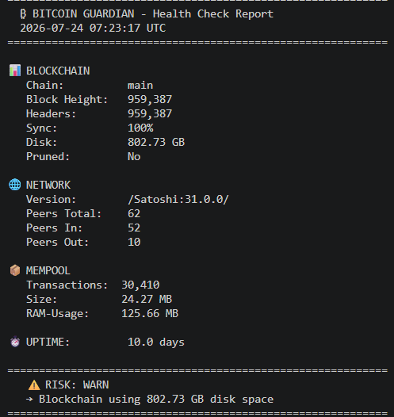

# Bitcoin Guardian

Health-check monitor for a Bitcoin full node, with an optional LLM agent that explains the state in plain English.



Built on a Raspberry Pi 5 running Umbrel, in a home lab.

---

## What It Does

Bitcoin Guardian connects to a live Bitcoin full node via the Bitcoin Core RPC interface and reports the things that matter: is the node synced, are peers connected, is the mempool healthy, how much disk is in use.

Two modes:

- **Rule-based** (default) — fast check, plain output, runs anywhere Python runs
- **Agent mode** (`--agent`) — same data, plus an LLM that reasons about it and writes a Markdown report

The agent does not take action. It observes, reasons, reports. No automation, no auto-fixing, no surprises.

---

## What It Monitors

| Check             | Source                | Description                                    |
|-------------------|-----------------------|------------------------------------------------|
| Block height      | Bitcoin Core RPC      | Current blockchain tip                         |
| Sync status       | Bitcoin Core RPC      | Is the node fully synced?                      |
| Peer connections  | Bitcoin Core RPC      | Total, inbound and outbound peers              |
| Mempool           | Bitcoin Core RPC      | Transaction count and size                     |
| Disk usage        | Bitcoin Core RPC      | Blockchain size on disk                        |
| Node uptime       | Bitcoin Core RPC      | How long the node has been running             |
| Risk level        | Local logic           | LOW / WARN / CRITICAL with reasons             |

---

## Risk Assessment

| Level         | Condition                                                                |
|---------------|--------------------------------------------------------------------------|
| 🚨 CRITICAL   | Node not synced, or fewer than 3 peers                                   |
| ⚠️ WARN       | Few peers, no inbound connections, mempool > 300 MB, or disk > 600 GB    |
| ✅ LOW        | Everything looks good                                                    |

---

## Quick Start (rule-based mode)

Clone the repo and install the basics:

```bash
git clone https://github.com/andy-builds-ai/bitcoin-guardian.git
cd bitcoin-guardian
pip install -r requirements.txt
```

Create your `.env` file from the template:

```bash
cp .env.example .env
```

Edit `.env` with your RPC credentials:

```
BTC_RPC_HOST=192.168.x.x
BTC_RPC_PORT=8332
BTC_RPC_USER=your_rpc_user
BTC_RPC_PASS=your_rpc_password
```

Run:

```bash
python bitcoin_guardian.py
```

You get a console report with risk level and reasons.

---

## Agent Mode (optional)

Agent mode adds an LLM on top. The agent reads the same RPC data, writes a Markdown report in `reports/`, and runs a hallucination check that flags any number in the response that doesn't appear in the source data.

Install the agent extras:

```bash
pip install -r requirements-agent.txt
```

Add your Anthropic API key to `.env`:

```
ANTHROPIC_API_KEY=sk-ant-api03-yourKeyHere
```

Run:

```bash
python bitcoin_guardian.py --agent
```

A Markdown report lands in `reports/YYYY-MM-DD_HHMM.md`.

### Switching Providers

The agent supports two providers: Anthropic Claude (default) and a local Ollama model. Pick one with the `--provider` flag:

```bash
python bitcoin_guardian.py --agent                     # Anthropic Claude (default)
python bitcoin_guardian.py --agent --provider ollama   # local Ollama model
```

Default model is `claude-haiku-4-5`. For the local path, run Ollama with `gemma3:4b` (or any compatible model) — no code edit needed.

---

## Architecture

```
bitcoin_guardian.py    # Main script. Both modes live here.
llm_providers.py       # Provider abstraction (Anthropic, Ollama).
validators.py          # Hallucination check via number extraction with tolerance.
reports/               # Markdown reports (gitignored).
```

The pattern is `call_llm(prompt, provider=...)` — provider-agnostic, easy to swap. Same shape will be reused for future modules.

---

## Stack

- **Language:** Python 3
- **Node interface:** Bitcoin Core JSON-RPC (via `requests`)
- **LLM:** Anthropic Claude API (default), Ollama (optional, local)
- **Hardware:** Raspberry Pi 5 running Umbrel
- **Network:** Local only — no external exposure

---

## Why This Exists

I'm Andreas — 43, ten years on road construction sites driving asphalt rollers, ten years in warehouse logistics, now teaching myself Python and building toward a career in AI engineering.

Bitcoin Guardian was my first real Python project: not a tutorial exercise, something that runs against real hardware and does something useful. The agent mode is my first real LLM agent — also against real data, with real failure modes I had to debug. Both modes monitor the same node every day.

If it helps anyone else running a node, good. The repo is here to be read.

---

## License

MIT — see [LICENSE](LICENSE).

---

*Built on a Raspberry Pi 5. Watched over by a guy who used to drive asphalt rollers for a living.*